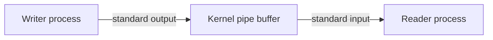

# Diagrams

Climb to a diagram only when the reader must see parts and a connection: architecture, a data path, a sequence, or a state change. If one sentence already answers the question, do not draw.

## One diagram, one claim

State the claim in a mermaid comment on the first lines, or in one sentence above the figure. Every box and every arrow must serve that claim. Delete decoration.

A raw `.mmd` file has no markdown fence. The first real line is the mermaid keyword (`flowchart`, `graph`, `sequenceDiagram`, and the other mermaid types).

## Mermaid or a static figure

- Use mermaid when the agent can diff the source and a renderer may be missing.
- Use a static figure only when position, scale, or a real picture is the claim.
- Do not invent a PNG. If `mmdc` is not installed, `scripts/render_diagram` prints the source and stops. The source is still the artifact.

## Labels

Labels use the same nouns as the prose. If the prose says "write end", the box does not say "ingress". Keep labels short. A label is a noun phrase, not a paragraph.

## Check against the prose

Before you finish:

- Each box is a thing the prose names.
- Each arrow is a relation the prose states.
- The prose does not describe a path that the diagram hides.
- The diagram does not add a path the prose never stated.

Run `scripts/render_diagram FILE.mmd`. Exit 0 means the first keyword is a mermaid type. If `mmdc` exists, the script also writes an SVG next to the source. It never writes a fake PNG.
